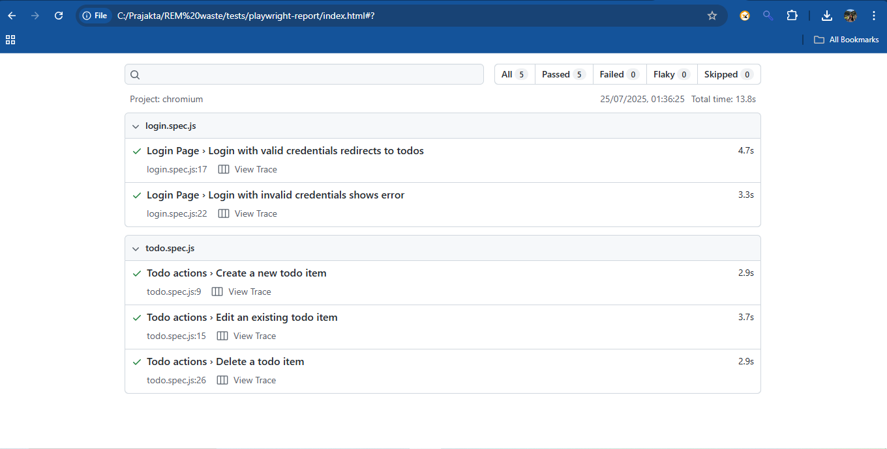
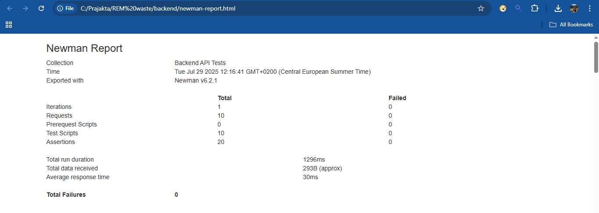

# My Todo App

## Overview
A full-stack Todo application with a React frontend, Node.js backend, automated UI/API tests, code coverage, and CI/CD integration. The project features login, CRUD operations, and robust test automation with visual snapshots.

---

## Setup Instructions

### Backend
```bash
cd backend
npm install
npm start
```
Backend runs at [http://localhost:4000](http://localhost:4000)

### Frontend
```bash
cd frontend
npm install
npm start
```
Frontend runs at [http://localhost:3000](http://localhost:3000)

### UI Tests (Playwright)
```bash
cd tests
npm install
npx playwright test
```
- To generate an HTML report:
  ```bash
  npx playwright test --reporter=html
  ```
- Open `playwright-report/index.html` to view the report.

---

## API Tests (Postman/Newman)
```bash
cd backend
npm install -g newman
newman run api-tests.postman_collection.json
```
- To generate an HTML report:
  ```bash
  newman run api-tests.postman_collection.json -r cli,html --reporter-html-export newman-report.html
  ```

---

## CI/CD & Artifacts
- GitHub Actions runs all tests and builds on every push/PR.
- **Test reports, code coverage, and Playwright visual snapshots are uploaded as artifacts** in each workflow run.
- To view:
  1. Go to your repository on GitHub.
  2. Click the **Actions** tab.
  3. Select the latest workflow run.
  4. Download artifacts:
     - `newman-report` (API test report)
     - `playwright-report` (UI test report)
     - `playwright-snapshots` (screenshots and traces for failed UI tests)
     - `backend-coverage` (backend code coverage)

---

## Visual Snapshots
- Playwright automatically captures screenshots and traces for failed UI tests.
- These are available as the `playwright-snapshots` artifact in CI/CD.
- Download and open locally to review test failures visually.

---

## Test Result Snapshots

Below are some example screenshots and visual snapshots from automated UI and API tests:

### UI Test Snapshot

### API Test Snapshot


> **Note:**  
> For the latest and full set of test reports and visual snapshots, download the artifacts from the Actions tab in GitHub.

---

## Documentation & Test Plan
- See [`TEST_PLAN.md`](./TEST_PLAN.md) for detailed test strategy, coverage, and instructions.
- See [`frontend/README.md`](./frontend/README.md) and [`backend/README.md`](./backend/README.md) for more details on each part.

---

## Attribution
This project is **heavily enhanced** from the original open source project by [Harshit Bansal](https://github.com/HarsDev01/react-todo-app).

Original repository: [https://github.com/HarsDev01/react-todo-app](https://github.com/HarsDev01/react-todo-app) 